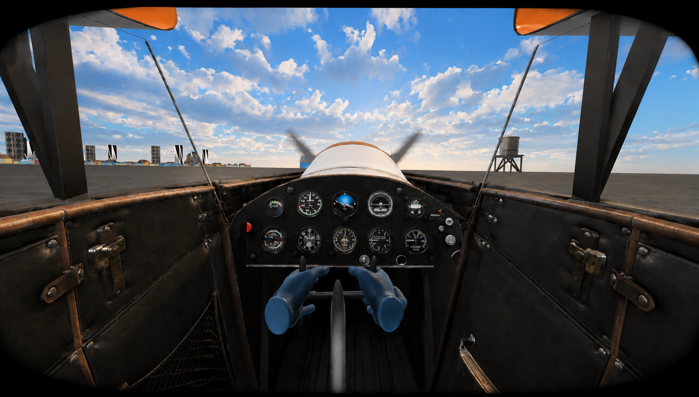
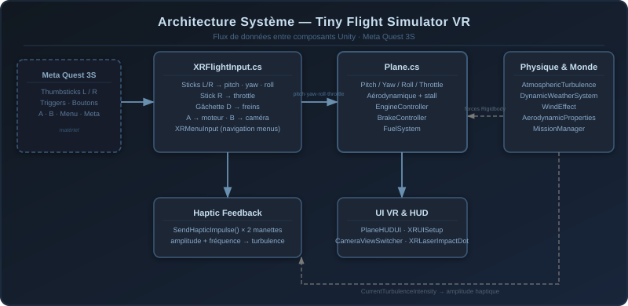
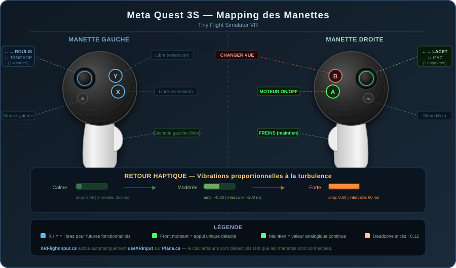
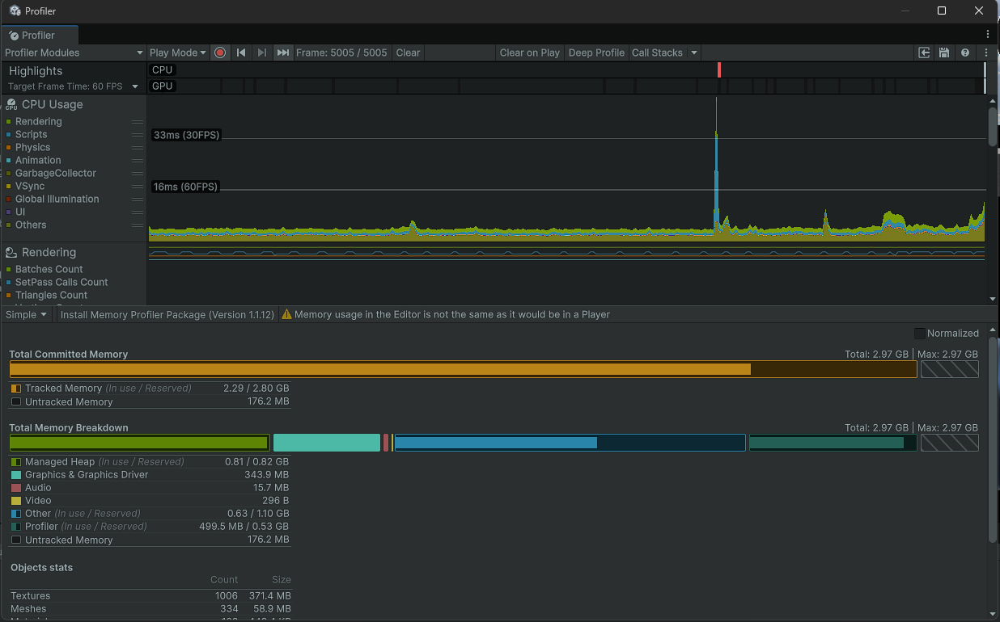
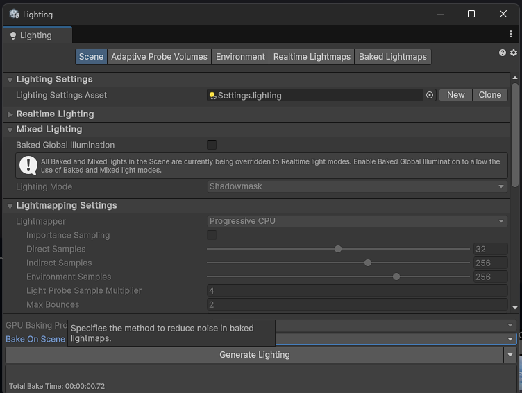
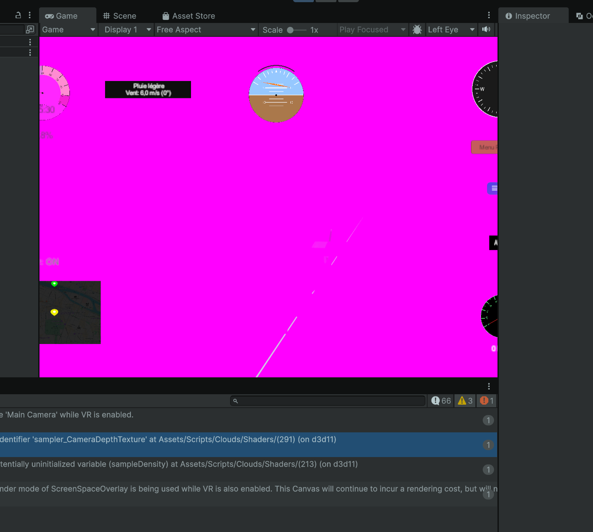

<div align="center">

# Tiny Flight Simulator - VR Edition




**Simulateur de vol procédural en réalité virtuelle pour Meta Quest 3S**

*Construit avec Unity 6000.0.41f1 · XR Interaction Toolkit 3.0.10 · OpenXR 1.14.0*

</div>

---

## Table des matières

1. [Présentation du projet](#1-présentation-du-projet)
2. [Packages Unity requis](#2-packages-unity-requis)
3. [Architecture générale du système](#3-architecture-générale-du-système)
4. [Portage Clavier/Souris → Meta Quest 3S](#4-portage-claviersouris--meta-quest-3s)
   - 4.1 [Mapping des manettes](#41-mapping-des-manettes)
   - 4.2 [XRFlightInput.cs - Contrôle vol VR](#42-xrflightinputcs--contrôle-vol-vr)
   - 4.3 [Modification de Plane.cs](#43-modification-de-planecs)
5. [Feedback Haptique - Turbulences](#5-feedback-haptique--turbulences)
6. [Interface Utilisateur VR](#6-interface-utilisateur-vr)
   - 6.1 [XRUISetup.cs - Configuration automatique des Canvas](#61-xruisetupcs--configuration-automatique-des-canvas)
   - 6.2 [XRMenuInput.cs - Navigation menu aux manettes](#62-xrmenuinputcs--navigation-menu-aux-manettes)
   - 6.3 [XRLaserImpactDot.cs - Point d'impact laser visuel](#63-xrlaserimpactdotcs--point-dimpact-laser-visuel)
7. [Vue Cockpit en VR](#7-vue-cockpit-en-vr)
   - 7.1 [CameraViewSwitcher.cs - Vue XR Origin](#71-cameraviewswitchercs--vue-xr-origin)
   - 7.2 [CockpitAutoGrab.cs - Mains VR sur le volant](#72-cockpitautograbcs--mains-vr-sur-le-volant)
8. [Systèmes de jeu](#8-systèmes-de-jeu)
   - 8.1 [Moteur aérodynamique réaliste](#81-moteur-aérodynamique-réaliste)
   - 8.2 [Moteur & Carburant](#82-moteur--carburant)
   - 8.3 [Freins](#83-freins)
   - 8.4 [Turbulences atmosphériques](#84-turbulences-atmosphériques)
   - 8.5 [Météo dynamique & Vent](#85-météo-dynamique--vent)
   - 8.6 [Stabilité au sol & Décollage](#86-stabilité-au-sol--décollage)
   - 8.7 [Missions et scénarios](#87-missions-et-scénarios)
9. [Configuration Unity - Guide pas à pas](#9-configuration-unity--guide-pas-à-pas)
10. [Checklist d'optimisation VR](#10-checklist-doptimisation-vr)
    - 10.1 [Diagnostic et outils de mesure](#101-diagnostic-et-outils-de-mesure)
    - 10.2 [Optimisation des modèles 3D](#102-optimisation-des-modèles-3d)
    - 10.3 [Optimisation de la complexité](#103-optimisation-de-la-complexité)
    - 10.4 [Optimisation statique et batching](#104-optimisation-statique-et-batching)
    - 10.5 [Optimisation de l'éclairage](#105-optimisation-de-léclairage)
    - 10.6 [Paramètres projet et culling](#106-paramètres-projet-et-culling)
11. [Compilation apk](#11-compilation-apk)
12. [Video démo](#12-video-demo)
---

## 1. Présentation du projet

**Tiny Flight Simulator** est un simulateur de vol procédural développé sous Unity qui a été entièrement adapté pour la réalité virtuelle sur **Meta Quest 3S**. Le projet est parti d'une expérience de bureau pilotée au clavier et à la souris, et a été transformé en une expérience VR immersive permettant au joueur de :

- Décoller et piloter un avion en utilisant uniquement les **manettes Quest 3S**
- Ressentir les **turbulences via le feedback haptique** des manettes
- Interagir avec tous les **menus et le HUD** grâce aux **lasers XR**
- Passer en **vue cockpit immersive** avec les mains VR positionnées sur le volant
- Voler dans un **monde procédural** avec météo dynamique, vent, et scénarios de mission

### Technologies clés

| Technologie | Version |
|---|---|
| Unity | 6000.0.41f1 |
| XR Interaction Toolkit | 3.0.10 |
| Meta OpenXR | 2.5.0 |
| Oculus XR Plugin | 4.5.0 |
| OpenXR | 1.14.0 |
| Cible matérielle | Meta Quest 3S |
| API Android minimale | 29 |
| Architecture | ARM64 (IL2CPP) |

---

## 2. Packages Unity requis

Les packages suivants doivent être présents dans `Packages/manifest.json` :

```json
"com.unity.xr.interaction.toolkit": "3.0.10",
"com.unity.xr.meta-openxr": "2.5.0",
"com.unity.xr.oculus": "4.5.0",
"com.unity.xr.openxr": "1.14.0",
"com.unity.inputsystem": "(inclus via XRI)"
```

**Dans Project Settings → XR Plug-in Management :**
- Platform Android → cocher **OpenXR**
- Interaction Profiles → ajouter **Meta Quest Touch Pro Controller Profile**
- Feature Sets → activer **Meta Quest Support**

---

## 3. Architecture générale du système

Le diagramme ci-dessous montre comment les différents scripts communiquent entre eux, depuis la lecture des manettes jusqu'aux forces physiques appliquées au Rigidbody de l'avion.



> **Lecture du diagramme :** Les flèches bleues représentent les données d'input XR, les vertes les valeurs appliquées aux scripts de vol, les rouges les forces physiques envoyées au Rigidbody, et les jaunes le signal de feedback haptique issu des turbulences.

### Résumé du flux de données

```
Quest 3S (Hardware)
    │
    ▼
XRFlightInput.cs ──► Plane.cs (Pitch / Yaw / Roll / Throttle)
    │                    │
    ├──► EngineController.cs (A button → ToggleEngine)
    ├──► BrakeController.cs  (gâchette droite → brakesOn)
    ├──► CameraViewSwitcher  (B button → ToggleView)
    │
    └── AtmosphericTurbulence.cs ──► SendHapticImpulse × 2 manettes
            │
            └──► Rigidbody (forces + couples aléatoires)
```

---

## 4. Portage Clavier/Souris → Meta Quest 3S

### 4.1 Mapping des manettes



#### Tableau de correspondance complet

| Action | Contrôle AVANT (clavier) | Contrôle VR (Quest 3S) |
|---|---|---|
| **Roulis gauche/droit** | `←` / `→` (flèches) | Stick gauche X |
| **Tangage haut/bas** | `↑` / `↓` (flèches) | Stick gauche Y (inversé) |
| **Lacet gauche/droit** | `Q` / `D` (AZERTY) | Stick droit X |
| **Gaz - augmenter** | `Left Shift` (maintenu) | Stick droit Y vers le haut (maintenu) |
| **Gaz - diminuer** | `Left Ctrl` (maintenu) | Stick droit Y vers le bas (maintenu) |
| **Freins** | `Espace` (maintenu) | Gâchette droite (maintenue, seuil 0.5) |
| **Moteur ON/OFF** | *(bouton UI uniquement)* | Bouton **A** (manette droite) - front montant |
| **Changer vue caméra** | Touche `V` | Bouton **B** (manette droite) - front montant |
| **Vue souris (cockpit)** | Mouris libre | Mouvement de tête (6DOF casque) |
| **Recalibrer vue** | Touche `C` | *(recalibration Quest native)* |

> **Convention tangage :** pousser le stick gauche vers l'avant fait descendre le nez (tangage négatif), le tirer vers soi remonte le nez - convention aéronautique standard.

#### Deadzone et sensibilités (valeurs par défaut)

| Paramètre | Valeur | Description |
|---|---|---|
| `joystickDeadzone` | 0.12 | Deadzone circulaire sur les deux sticks |
| `rollSensitivity` | 1.0 | Multiplicateur roulis |
| `pitchSensitivity` | 1.0 | Multiplicateur tangage |
| `yawSensitivity` | 1.0 | Multiplicateur lacet |
| `throttleChangeRate` | 0.6 /s | Vitesse de variation des gaz |
| `brakeThreshold` | 0.5 | Pression minimale gâchette pour freinage |

Tous ces paramètres sont **ajustables dans l'Inspector Unity** sans recompilation.

---

### 4.2 XRFlightInput.cs - Contrôle vol VR

**Chemin :** `Assets/Scripts/XR/XRFlightInput.cs`

Ce script est le point d'entrée central du contrôle VR. Il remplace entièrement la lecture des inputs clavier/souris du jeu original.

#### Fonctionnement technique

```csharp
// Lecture des manettes via UnityEngine.XR.InputDevice
InputDevices.GetDevicesWithCharacteristics(
    InputDeviceCharacteristics.Left | InputDeviceCharacteristics.Controller,
    leftList);

// Chaque frame : lecture analogique des sticks
leftCtrl.TryGetFeatureValue(CommonUsages.primary2DAxis, out leftStick);
rightCtrl.TryGetFeatureValue(CommonUsages.primary2DAxis, out rightStick);

// Application sur le Plane (via setters publics)
plane.Roll  =  leftStick.x  * rollSensitivity;   // roulis
plane.Pitch = -leftStick.y  * pitchSensitivity;  // tangage inversé
plane.Yaw   =  rightStick.x * yawSensitivity;    // lacet
plane.throttle += rightStick.y * throttleChangeRate * Time.deltaTime;
```

#### Détection connexion/déconnexion

Le script s'abonne aux événements Unity XR pour réagir automatiquement aux changements de connexion :

```csharp
InputDevices.deviceConnected    += OnDeviceConnected;
InputDevices.deviceDisconnected += OnDeviceDisconnected;
```

Les propriétés `leftControllerFound` et `rightControllerFound` sont visibles dans l'Inspector en lecture seule, permettant un diagnostic rapide.

#### Auto-résolution des références

En l'absence d'assignation manuelle dans l'Inspector, le script cherche automatiquement les composants requis au démarrage via `GetComponentInParent<>()` et `FindObjectOfType<>()`.

#### Setup dans Unity

1. Ajouter `XRFlightInput` sur le GameObject de l'avion (ou un GameObject dédié dans la scène)
2. Optionnel : assigner manuellement dans l'Inspector :
   - `plane` → script `Plane` de l'avion
   - `brakeController` → `BrakeController` de l'avion
   - `engineController` → `EngineController` de l'avion
   - `cameraViewSwitcher` → `CameraViewSwitcher` de la scène
   - `atmosphericTurbulence` → `AtmosphericTurbulence` de l'avion
3. Si laissés vides, ils seront trouvés automatiquement

---

### 4.3 Modification de Plane.cs

**Chemin :** `Assets/Scripts/3rd Party/MouseFlight/Demo/Scripts/Plane.cs`

Le script original lisait les inputs directement en dur dans sa méthode `HandleInput()`. Pour permettre au système VR de prendre le contrôle sans conflit, un flag **`useXRInput`** a été ajouté.

#### Changement appliqué

```csharp
[Header("XR Input")]
[Tooltip("Quand actif, désactive le clavier/souris - les inputs sont pilotés par XRFlightInput.")]
public bool useXRInput = false;

private void HandleInput()
{
    // Court-circuit total quand XRFlightInput est actif
    if (useXRInput)
    {
        rawPitchCommand = pitch;
        rawRollCommand  = roll;
        rawYawCommand   = yaw;
        return;  // ← tout l'input clavier/souris est ignoré
    }

    // ... code clavier/souris original inchangé ...
}
```

**`XRFlightInput.cs` active ce flag automatiquement** via `plane.useXRInput = true` dans son `OnEnable()`, et le remet à `false` dans `OnDisable()`. Cela garantit :
- La **compatibilité backward** : désactiver `XRFlightInput` restaure immédiatement le contrôle clavier
- Aucun conflit d'input entre les deux systèmes dans la même frame

---

## 5. Feedback Haptique - Turbulences

L'une des fonctionnalités immersives majeures de la version VR est le **retour haptique synchronisé aux turbulences atmosphériques**. Les deux manettes vibrent en temps réel avec une intensité proportionnelle aux forces exercées sur l'avion.

### Architecture du système haptique

```
AtmosphericTurbulence.cs
    │   [FixedUpdate - calcule totalIntensity]
    │   CurrentTurbulenceIntensity = Clamp01(totalIntensity / baseTurbulenceIntensity)
    │
    ▼
XRFlightInput.cs - UpdateTurbulenceHaptics() [appelé à chaque Update]
    │
    ├── intensity > hapticDeadzone (0.05) ?
    │       NON → hapticTimer = 0, return
    │       OUI ↓
    ├── t = InverseLerp(deadzone, 1, intensity)
    ├── amplitude = Lerp(0.05, 0.60, t) × Random(0.7, 1.0)
    ├── interval  = Lerp(350ms, 60ms, t)  × Random(0.8, 1.2)
    │
    └── leftCtrl.SendHapticImpulse(0, amplitude, 40ms)
        rightCtrl.SendHapticImpulse(0, amplitude, 40ms)
```

### Paramètres haptiques

| Paramètre | Défaut | Description |
|---|---|---|
| `hapticAmplitudeMin` | 0.05 | Vibration à turbulence faible (quasi imperceptible) |
| `hapticAmplitudeMax` | 0.60 | Vibration à turbulence maximale |
| `hapticPulseDuration` | 0.04 s | Durée de chaque impulsion |
| `hapticIntervalMax` | 0.35 s | Intervalle entre impulsions - turbulence faible |
| `hapticIntervalMin` | 0.06 s | Intervalle entre impulsions - turbulence forte |
| `hapticDeadzone` | 0.05 | Seuil minimal d'intensité |

### Modification d'AtmosphericTurbulence.cs

Un getter public a été ajouté pour exposer l'intensité calculée :

```csharp
/// <summary>Intensité de turbulence actuelle [0-1], lue par XRFlightInput pour les vibrations.</summary>
public float CurrentTurbulenceIntensity { get; private set; }

// Dans ApplyTurbulence() :
CurrentTurbulenceIntensity = Mathf.Clamp01(totalIntensity / baseTurbulenceIntensity);
```

### Variation aléatoire pour le réalisme

La variation aléatoire ±20 % sur l'amplitude et ±20 % sur l'intervalle est intentionnelle : elle simule la nature irrégulière et imprévisible des turbulences réelles, évitant l'effet mécanique d'un moteur de vibration régulier.

---

## 6. Interface Utilisateur VR

En VR, les Canvas Unity standard (ScreenSpaceOverlay) sont invisibles. Trois scripts ont été développés pour rendre toute l'interface utilisateur pleinement fonctionnelle avec les lasers des manettes.

### 6.1 XRUISetup.cs - Configuration automatique des Canvas

**Chemin :** `Assets/Scripts/XR/XRUISetup.cs`

Ce script s'exécute au démarrage de chaque scène et transforme automatiquement toute l'UI pour la compatibilité XR :

#### Opérations effectuées

1. **Remplacement du module d'input** : supprime le `StandaloneInputModule` (clavier/souris) et le remplace par `XRUIInputModule` sur l'EventSystem. Sans ce remplacement, les clics des lasers XR ne déclenchent pas les boutons Unity.

2. **Remplacement du Raycaster** : remplace tous les `GraphicRaycaster` standard par `TrackedDeviceGraphicRaycaster` sur chaque Canvas. Ce composant permet au système de raycast XR (lasers des manettes) de détecter les éléments UI.

3. **Conversion Canvas Overlay → WorldSpace** : les Canvas en mode `ScreenSpaceOverlay` sont invisibles en VR (ils se superposent directement à la frame du casque sans profondeur). Ce script les convertit automatiquement en `WorldSpace` et les positionne à une distance configurable devant la caméra principale.

```csharp
// Exemple de conversion automatique
canvas.renderMode = RenderMode.WorldSpace;
canvas.transform.position = Camera.main.transform.position
                           + Camera.main.transform.forward * hudWorldDistance;
canvas.transform.localScale = Vector3.one * hudWorldScale; // pixels → mètres
```

#### Setup dans Unity

Ajouter le composant `XRUISetup` sur n'importe quel GameObject actif dans la scène (recommandé : le même que `XRMenuInput`).

---

### 6.2 XRMenuInput.cs - Navigation menu aux manettes

**Chemin :** `Assets/Scripts/UI/XRMenuInput.cs`

Permet de naviguer dans les menus du jeu (menu principal, sélection piste, etc.) entièrement sans clavier.

#### Mapping navigation

| Action | Contrôle Quest 3S |
|---|---|
| Naviguer entre boutons | Joystick gauche **ou** droit (haut/bas) |
| Cliquer le bouton sélectionné | Gâchette gauche **ou** droite |
| Anti-rebond | Cooldown configurable (défaut 250 ms) |

#### Highlight visuel

Le script gère manuellement la couleur de surbrillance du bouton actuellement sélectionné, en mémorisant les couleurs d'origine (`normalColor`) pour les restaurer lors de la désélection. Cette approche contourne les limitations du `ColorBlock` Unity en VR.

#### Détection des manettes

Utilise `UnityEngine.XR.InputDevice` avec `InputDeviceCharacteristics.Controller` pour détecter indépendamment les manettes gauche et droite.

---

### 6.3 XRLaserImpactDot.cs - Point d'impact laser visuel

**Chemin :** `Assets/Scripts/XR/XRLaserImpactDot.cs`

Ajoute un **point d'impact visuel** (dot + halo lumineux) à l'endroit précis où le laser de chaque manette touche une surface (géométrie 3D ou interface UI WorldSpace).

#### Caractéristiques techniques

- S'attache **automatiquement** à tous les `XRRayInteractor` présents dans la scène via `[RuntimeInitializeOnLoadMethod]`, sans nécessiter de configuration manuelle
- Composé de deux `SpriteRenderer` : un point central opaque et un halo semi-transparent
- **Fondu d'apparition/disparition** fluide via interpolation de l'alpha (vitesse configurable)
- Fonctionne dans toutes les scènes (menu, vol) sans setup additionnel

```csharp
[RuntimeInitializeOnLoadMethod(RuntimeInitializeLoadType.AfterSceneLoad)]
static void AutoAttach()
{
    var interactors = FindObjectsOfType<XRRayInteractor>(true);
    foreach (var ri in interactors)
    {
        if (ri.GetComponent<XRLaserImpactDot>() == null)
            ri.gameObject.AddComponent<XRLaserImpactDot>();
    }
}
```

#### Paramètres visuels

| Paramètre | Défaut | Description |
|---|---|---|
| `dotColor` | Rouge orangé `#FF4026` | Couleur du point central |
| `haloColor` | Orange transparent | Couleur du halo |
| `dotRadius` | 0.014 m | Rayon du point |
| `haloScale` | 4× | Taille du halo par rapport au point |
| `surfaceOffset` | 0.003 m | Décalage du point par rapport à la surface |
| `fadeSpeed` | 14 | Vitesse d'apparition/disparition |

---

## 7. Vue Cockpit en VR

### 7.1 CameraViewSwitcher.cs - Vue XR Origin

**Chemin :** `Assets/Scripts/CameraViewSwitcher.cs`

Ce script gère le basculement entre vue extérieure et vue cockpit. Il a été **adapté pour la VR** avec la prise en charge de l'XR Origin.

#### Adaptation VR

En mode VR, déplacer la caméra Unity directement ne suffit pas : c'est le **XR Origin** (le GameObject racine du rig VR) qui doit être repositionné. Le script détecte automatiquement s'il est en VR et agit en conséquence :

```csharp
[Header("VR Support")]
[Tooltip("Racine XR Origin - repositionnée en VR plutôt que la caméra")]
public Transform xrOrigin;
```

En vue cockpit VR :
- L'XR Origin est parenté à l'avion
- La position est calée sur `cockpitViewOffset` (configurable)
- Le suivi de tête 6DOF du casque fonctionne nativement (le joueur peut regarder autour)

#### Déclenchement VR

Le bouton **B** de la manette droite appelle `ToggleView()` depuis `XRFlightInput.cs`. En version clavier, c'était la touche `V`.

---

### 7.2 CockpitAutoGrab.cs - Mains VR sur le volant

**Chemin :** `Assets/Scripts/XR/CockpitAutoGrab.cs`

En vue cockpit, ce script positionne automatiquement les **modèles de mains VR sur le volant**, créant l'illusion que le joueur tient physiquement les commandes.

#### Problème résolu

En VR, le système XR Interaction Toolkit déplace les modèles de mains en suivant le tracking physique des manettes. En vue cockpit, les mains doivent rester fixes sur le volant indépendamment des mouvements réels du joueur.

#### Solution technique

```csharp
[DefaultExecutionOrder(10000)]  // s'exécute EN DERNIER après tous les autres scripts
public class CockpitAutoGrab : MonoBehaviour
{
    void LateUpdate()
    {
        if (!isAttached) return;

        // 1. TrackedPoseDriver désactivé → arrête le suivi physique des mains
        // 2. Force la position MONDE du modèle de main sur l'AttachPoint du volant
        leftHandModel.transform.position = anchor.TransformPoint(leftHandCockpitPos);
        rightHandModel.transform.position = anchor.TransformPoint(rightHandCockpitPos);

        // 3. SetActive(true) pour contrer le masquage automatique par XRI
        if (!leftHandModel.activeSelf) leftHandModel.SetActive(true);
        if (!rightHandModel.activeSelf) rightHandModel.SetActive(true);
    }
}
```

**`[DefaultExecutionOrder(10000)]`** est critique : ce script doit s'exécuter **après** `CameraViewSwitcher`, `ActionBasedController` et `TrackedPoseDriver` pour avoir le dernier mot sur la position des mains.

#### Comportement selon la vue

| Vue | Comportement des mains |
|---|---|
| Vue extérieure | Tracking normal (mains suivent les manettes physiques) |
| Vue cockpit | Mains collées sur les AttachPoints du volant (délai configurable : 150 ms) |

#### Setup dans Unity

| Champ Inspector | Description |
|---|---|
| `viewSwitcher` | `CameraViewSwitcher` de la scène |
| `leftControllerTransform` | Transform `Left Controller` (sous XR Origin > Camera Offset) |
| `rightControllerTransform` | Transform `Right Controller` |
| `leftHandModel` | GameObject `Left Hand Model` (enfant du contrôleur gauche) |
| `rightHandModel` | GameObject `Right Hand Model` (enfant du contrôleur droit) |
| `cockpitAnchor` | Transform vide placé sur le volant (point d'ancrage) |
| `leftHandCockpitPos` | Offset main gauche depuis l'ancre (vecteur local) |
| `rightHandCockpitPos` | Offset main droite depuis l'ancre (vecteur local) |

---

## 8. Systèmes de jeu

### 8.1 Moteur aérodynamique réaliste

**Chemin :** `Assets/Scripts/3rd Party/MouseFlight/Demo/Scripts/Plane.cs` + `AerodynamicProperties.cs`

Le moteur de vol simule une aérodynamique complète :

| Propriété | Valeur par défaut | Description |
|---|---|---|
| `maxThrust` | 13 000 N | Poussée maximale du moteur |
| `turnTorque` | (12, 6, 10) | Couple pitch/yaw/roll en Nm |
| `wingArea` | 8.0 m² | Surface alaire |
| `maxLiftCoef` | 1.2 | Coefficient de portance maximum |
| `criticalAngleOfAttack` | 12° | Angle d'attaque optimal |
| `stallAngle` | 15° | Angle de décrochage |
| `parasiteDragCoef` | 0.03 | Traînée parasite |
| `takeoffMinSpeed` | 70 m/s | Vitesse minimale de décollage |

#### Comportement de décrochage

Le script détecte le décrochage (`isStalled`) quand `|angleOfAttack| > stallAngle`. En cas de décrochage :
- La portance est drastiquement réduite
- Les surfaces de contrôle perdent en efficacité (`stallControlEffectiveness = 0.3`)
- Des turbulences aléatoires sont ajoutées au mouvement de l'avion

#### Densité de l'air selon l'altitude

`AtmosphericTurbulence.cs` applique une formule atmosphérique exponentielle pour modifier la portance et la traînée :

```
densité = densité_mer × e^(-altitude × 0.00012)
```

La portance diminue progressivement à haute altitude, rendant le vol plus difficile au-dessus de 2 000 m.

---

### 8.2 Moteur & Carburant

**EngineController.cs** gère l'état ON/OFF du moteur :
- Coupe automatiquement le throttle si le moteur est éteint (`plane.throttle = 0`)
- Anime l'hélice avec décélération progressive à l'extinction
- Joue des sons moteur avec pitch variable selon le régime (configurable dans l'Inspector)
- En VR : déclenché par le **bouton A** de la manette droite

**FuelSystem.cs** gère la consommation :
- Consommation proportionnelle au throttle (multiplicateur configurable)
- Consommation minimale au ralenti (20 % de la consommation max par défaut)
- Alerte visuelle à 15 % de carburant restant
- Aiguille de jauge animée en temps réel

---

### 8.3 Freins

**BrakeController.cs** applique une force de freinage sur le sol :
- Force de freinage : 15 000 N par défaut (configurable de 0 à 50 000 N)
- Freinage uniquement si l'avion est détecté au sol (raycast vers le bas)
- Distance de détection sol configurable
- En VR : déclenché par la **gâchette droite maintenue** (seuil 0.5 configurable)

---

### 8.4 Turbulences atmosphériques

**Chemin :** `Assets/Scripts/AtmosphericTurbulence.cs`

Génère des forces et couples aléatoires basés sur du **bruit de Perlin animé** pour simuler les turbulences atmosphériques :

#### Facteurs d'intensité

1. **Altitude** : les turbulences augmentent entre 100 m et 2 000 m, puis diminuent progressivement
2. **Météo** : si un `WeatherMap` est présent, les zones nuageuses multiplient les turbulences (`cloudTurbulenceMultiplier = 2×` par défaut)
3. **Fréquence** : la vitesse de variation du bruit de Perlin est configurable (`turbulenceFrequency`)

#### Exposition de l'intensité pour les haptics

```csharp
// Propriété ajoutée pour le système haptique
public float CurrentTurbulenceIntensity { get; private set; }

// Calculée en fin de ApplyTurbulence()
CurrentTurbulenceIntensity = Mathf.Clamp01(totalIntensity / baseTurbulenceIntensity);
```

---

### 8.5 Météo dynamique & Vent

**DynamicWeatherSystem.cs** contrôle l'environnement global :
- Intensité météo de 0 (beau temps) à 1 (tempête)
- Pluie (système de particules), brouillard, nuages volumétriques
- Calcule un vecteur de force de vent (`GetWindForce()`)

**WindEffect.cs** applique ce vent à l'avion :
- Force de vent directe sur le Rigidbody
- Couple de vent simulant l'effet sur les surfaces aérodynamiques
- Multiplicateurs séparés pour la force et le couple

---

### 8.6 Stabilité au sol & Décollage

Deux scripts coopèrent pour rendre le décollage réaliste :

**PlaneGroundStability.cs** (`[DefaultExecutionOrder(50)]`) :
- Détecte le contact au sol via les `WheelCollider`
- Stabilise le tangage à l'angle initial capturé au premier contact
- Relâche progressivement le contrôle au-delà de 2 m d'altitude (bande de transition configurable)
- Applique du damping sur le roulis et le lacet tant que l'avion est au sol

**PlaneStartupPitchHold.cs** (`[DefaultExecutionOrder(60)]`) :
- Maintient l'angle de tangage de départ jusqu'au décollage
- Couple correcteur proportionnel à l'erreur angulaire (`torquePerDegree`)
- Réduit automatiquement la correction si le pilote s'y oppose

---

### 8.7 Missions et scénarios

**MissionManager.cs** gère trois scénarios de jeu :

| Scénario | Description |
|---|---|
| **Vol Libre** | Météo agréable, heure : midi |
| **Vol dans la Tempête** | Météo orageuse (0.9), heure : 15h00 |
| **Mission 3 (Halloween)** | Orage intense, sons d'ambiance, images effrayantes, durée 10 min |

**GameInitializer.cs** charge les sélections du menu principal (`PlayerPrefs`) et applique les paramètres de scénario au démarrage de la scène de vol.

---

## 9. Configuration Unity - Guide pas à pas

### Étape 1 - Project Settings XR

```
Edit → Project Settings → XR Plug-in Management
  [Android]
    ☑ OpenXR
    Interaction Profiles → + Meta Quest Touch Pro Controller Profile
  
  [OpenXR] → Feature Groups
    ☑ Meta Quest Support
    ☑ Hand Tracking (optionnel)
```

### Étape 2 - Hiérarchie de scène recommandée

```
Scene
├── XR Origin (XR Rig)
│   ├── Camera Offset
│   │   ├── Main Camera
│   │   ├── Left Controller      ← TrackedPoseDriver + XRRayInteractor
│   │   │   └── Left Hand Model
│   │   └── Right Controller     ← TrackedPoseDriver + XRRayInteractor
│   │       └── Right Hand Model
├── EventSystem                  ← XRUIInputModule (ajouté par XRUISetup)
├── [Plane GameObject]
│   ├── Rigidbody
│   ├── Plane.cs
│   ├── XRFlightInput.cs         ← NOUVEAU
│   ├── EngineController.cs
│   ├── BrakeController.cs
│   ├── FuelSystem.cs
│   ├── AtmosphericTurbulence.cs
│   ├── WindEffect.cs
│   ├── PlaneGroundStability.cs
│   └── PlaneStartupPitchHold.cs
├── CameraViewSwitcher.cs
├── CockpitAutoGrab.cs           ← NOUVEAU
├── XRUISetup.cs                 ← NOUVEAU
└── Canvas (HUD)                 ← converti en WorldSpace par XRUISetup
```

### Étape 3 - Composant XRFlightInput

1. Sélectionner le GameObject de l'avion
2. **Add Component → XRFlightInput**
3. Les références sont auto-trouvées au démarrage. Pour les assigner manuellement :
   - `Plane` : script `Plane` de l'avion
   - `Brake Controller` : `BrakeController` de l'avion
   - `Engine Controller` : `EngineController` de l'avion
   - `Camera View Switcher` : `CameraViewSwitcher` de la scène
   - `Atmospheric Turbulence` : `AtmosphericTurbulence` de l'avion

### Étape 4 - CockpitAutoGrab

1. Créer un Transform vide sur le volant : nommer `CockpitAnchor`
2. Ajouter **CockpitAutoGrab** sur n'importe quel GameObject actif
3. Assigner :
   - `View Switcher` : `CameraViewSwitcher`
   - `Left/Right Controller Transform` : transforms sous XR Origin > Camera Offset
   - `Left/Right Hand Model` : modèles 3D de mains (enfants des contrôleurs)
   - `Cockpit Anchor` : le Transform vide créé sur le volant
4. Ajuster `leftHandCockpitPos` et `rightHandCockpitPos` pour positionner précisément les mains

### Étape 5 - XRUISetup

1. Ajouter **XRUISetup** sur un GameObject actif dans la scène
2. Configurer `hudWorldDistance` (défaut : 2 m) et `hudWorldScale` (défaut : 0.001)
3. Lancer la scène - tous les Canvas sont reconfigurés automatiquement

### Étape 6 - Build Android

```
File → Build Settings
  Platform : Android
  ☑ Development Build (pour les tests)
  
  Player Settings → Other Settings
    Graphics API : Vulkan
    Scripting Backend : IL2CPP
    Target Architectures : ARM64
    Minimum API Level : 29
```

---

## 1O. Checklist d'optimisation VR

> **Objectif cible Meta Quest 3S :** 72 Hz stables (13,8 ms par frame), GPU limité à 80 % maximum.  
> Le Quest 3S est un appareil autonome sans GPU dédié - chaque ms compte.

---

### 10.1 Diagnostic et outils de mesure

Avant toute optimisation, mesurer les vrais problèmes :

| Outil | Accès | Usage |
|---|---|---|
| **Unity Profiler** | Window → Analysis → Profiler | Identifier les scripts et rendus les plus coûteux frame par frame |
| **Unity Stats** (Scene/Game view) | Bouton *Stats* dans la Game View | Nombre de draw calls, triangles, SetPass calls en temps réel |
| **Oculus Performance HUD** | Meta Quest Settings → Developer → Performance Overlay | Overlay in-headset : CPU/GPU time, dropped frames, temperature |

> Ressource vidéo de référence : [Oculus Performance HUD Tutorial](https://www.youtube.com/watch?v=huGdw7Zf7-w)

**Seuils critiques Quest 3S :**
- Draw calls : < 100 (idéal < 50 avec batching)
- Triangles : < 500 000 par scène
- Textures VRAM : < 1 Go
- CPU frame time : < 8 ms
- GPU frame time : < 10 ms

---

### 10.2 Optimisation des modèles 3D

#### Polycount
- Utiliser des modèles LOD (Level of Detail) - Unity génère automatiquement des LOD via le composant **LOD Group**
- L'avion joueur (visible en permanence) : viser < 15 000 triangles
- Bâtiments, arbres en arrière-plan : < 500 triangles par objet lointain
- Désactiver les objets hors champ avec le **Frustum Culling** (activé par défaut)
- Outil Unity : *Window → Analysis → Profiler → Rendering* pour voir les triangles par objet

#### Partage de matériaux (Share Same Material)
- Chaque matériau unique = au moins un draw call supplémentaire
- Regrouper les textures dans des **Texture Atlases** (une seule texture pour plusieurs objets)
- Dans ce projet : regrouper tous les bâtiments sur un même matériau atlas si possible
- Vérifier via Stats : le compteur *Batches* doit descendre quand des objets partagent un matériau

> ⚠️ Le **GPU Instancing** (cocher *Enable GPU Instancing* dans le matériau) est très efficace pour les objets répétés comme les arbres ou les bâtiments identiques.

#### Shaders
- Éviter les shaders complexes (PBR avec normal maps, reflections) sur les objets secondaires
- Utiliser **Mobile/Diffuse** ou **Universal Render Pipeline/Simple Lit** pour les objets de background
- Le shader `InsideOutUnlit.shader` (déjà dans le projet) est un bon exemple de shader léger
- Éviter les shaders avec `GrabPass` - ils forcent une copie du framebuffer, très coûteux en VR

---

### 10.3 Optimisation de la complexité

#### Physics Optimization
- Réduire la fréquence du Fixed Timestep si possible : *Project Settings → Time → Fixed Timestep*  
  Valeur recommandée : `0.02` (50 Hz) - ne pas descendre en dessous pour la physique de vol
- Utiliser des **Collision Layers** pour éviter les collisions inutiles (*Physics Matrix* dans Project Settings)
- Les `Rigidbody` au repos doivent passer en **Sleep** automatiquement (vérifier `Rigidbody.sleepThreshold`)
- Éviter les MeshColliders sur des maillages complexes - préférer des **primitives** (Box, Sphere, Capsule)
- Dans ce projet : le terrain utilise un `TerrainCollider` - valider qu'il n'interagit pas avec des objets lointains

#### Script Optimization

- Éviter les appels `Find`, `GetComponent`, `Camera.main` dans `Update()` - les cacher en `Awake()` / `Start()`
- `XRFlightInput.cs` est déjà optimisé : tous les `GetComponent` sont en `Awake()`
- Utiliser `Time.deltaTime` plutôt que des Coroutines fréquentes pour les updates temporels
- Profiler les scripts suspects : *Profiler → CPU → Deep Profile* (activer uniquement en éditeur)
- Désactiver les `MonoBehaviour` non utilisés plutôt que de laisser leur `Update()` tourner à vide

#### Visual Effect Optimization
- Limiter le nombre de **particules actives simultanément** (Particle System → Max Particles)
- Les systèmes de particules du jet d'échappement : Max Particles < 200
- Désactiver les effets visuels hors champ caméra (`[RequireComponent]` + `OnBecameInvisible()`)
- Éviter les overdraw (transparences superposées) - vérifier avec la vue *Overdraw* dans la Scene View
- Préférer les **Shader Graph** Unlit aux effets post-process : le post-processing est très coûteux en VR

---

### 10.4 Optimisation statique et batching

#### Static Objects (Static Optimization)
- Cocher **Static** dans l'Inspector pour tout objet qui ne bouge jamais (bâtiments, arbres, terrain)
- Cela active automatiquement le **Static Batching**, le **Lightmapping** et l'**Occlusion Culling**
- Ne pas marquer l'avion joueur ou les objets animés comme Static !

#### Batching Static
- Le **Static Batching** fusionne plusieurs meshes statiques en un seul draw call
- *Project Settings → Player → Rendering → Static Batching* : activer
- Vérifier l'effet dans Stats : le compteur *Batches* doit baisser significativement
- Le **Dynamic Batching** (pour les petits objets mobiles < 900 vertices) : activer dans Player Settings

> ⚠️ Contrainte : les objets batché doivent partager **exactement le même matériau** (même instance).

---

### 10.5 Optimisation de l'éclairage

#### Bake Lighting
- Passer les lumières en mode **Baked** ou **Mixed** pour les lumières statiques de la scène
- Lancer un *Bake* complet : *Window → Rendering → Lighting → Generate Lighting*
- Les lumières baked ne coûtent rien au runtime - elles sont précalculées dans des lightmaps
- Dans ce projet : le soleil directionnel peut être en **Mixed**, les lumières de bâtiments en **Baked**
- Résolution des lightmaps : 20–40 texels/unité pour le terrain, 10–20 pour les bâtiments

#### Reflection Probes
- Passer les Reflection Probes en mode **Baked** (pas Realtime - très coûteux en VR)
- Placer une probe par zone distincte de l'environnement (cockpit, aéroport, ciel ouvert)
- Résolution des probes : 128×128 suffisant pour la plupart des surfaces

#### Lighting Probes (Light Probes)
- Les Light Probes permettent aux objets dynamiques (l'avion, les mains VR) de recevoir l'éclairage baked
- Placer un **Light Probe Group** sur la scène avec des probes réparties dans les zones navigables
- Densité recommandée : une probe tous les 10–20 mètres dans les zones de vol

---

### 10.6 Paramètres projet et culling

#### Project Settings Optimization
Paramètres clés pour Meta Quest 3S (*Edit → Project Settings*) :

| Paramètre | Valeur recommandée | Section |
|---|---|---|
| Color Space | **Linear** | Player → Other Settings |
| Multithreaded Rendering | **Activé** | Player → Other Settings |
| GPU Skinning | **Activé** | Player → Other Settings |
| Graphics API | **Vulkan** (en premier) | Player → Other Settings |
| Stereo Rendering Mode | **Multiview** | XR Plug-in Management |
| Fixed Foveated Rendering | **High** | Oculus → Quest Features |
| Dynamic Resolution | **Activé** (si framerate instable) | Universal Render Pipeline Asset |
| Shadow Distance | **50–100** | URP Asset → Shadows |
| Shadow Cascades | **1** (VR) | URP Asset → Shadows |
| MSAA | **4x** | URP Asset → Quality |

> **Fixed Foveated Rendering (FFR)** : réduit la résolution de rendu sur les bords du champ de vision (zone moins perçue par l'œil humain). Très efficace sur Quest 3S - gain GPU de 15–25 %.

#### Culling
- **Frustum Culling** : activé automatiquement par Unity - les objets hors caméra ne sont pas rendus
- **Occlusion Culling** : à configurer manuellement :
  1. Marquer les objets comme *Static*
  2. Créer un **Occlusion Area** dans la scène
  3. *Window → Rendering → Occlusion Culling → Bake*
  4. Vérifier le résultat avec la vue *Occlusion* dans la Scene View
- **Distance Culling** via LOD Groups : désactiver le rendu au-delà d'une certaine distance
  ```csharp
  // Dans Camera ou via LOD Group
  QualitySettings.lodBias = 0.5f; // Réduit la distance d'affichage des LOD détaillés
  ```
- **Layer-based Culling** : masquer certains layers selon la caméra pour éviter les draw calls inutiles
  ```csharp
  // Exemple : cacher les ombres à longue distance
  Camera.main.layerCullDistances = new float[] { ... };
  ```
---

<a id="11-compilation-apk"></a>
## 11. compilation apk

*Le jeu a été compilé mais impossible de jouer car la scène est  completement magenta, un problème d'affichage de shader en mode VR*


lien google drive vers le .apk(compte esiee)
[tinyflightsimulator.apk](https://drive.google.com/file/d/1rFSFQu661F-DWRK0cRwFryoU8uNr1XHh/view?usp=sharing)

---

<a id="12-video-demo"></a>
## 12. VIDEO DEMO

[video démo](https://drive.google.com/file/d/104XC_rTUR8OJJxlPbvPEy4MqQHUE_4Mn/view?usp=sharing)


